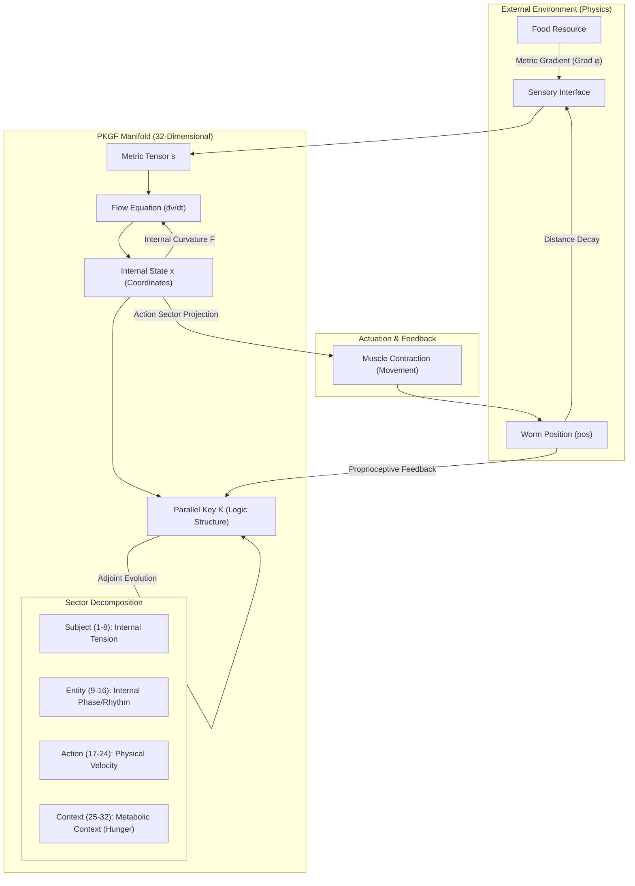
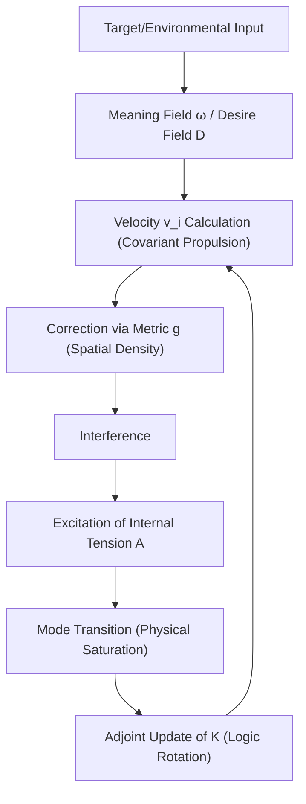
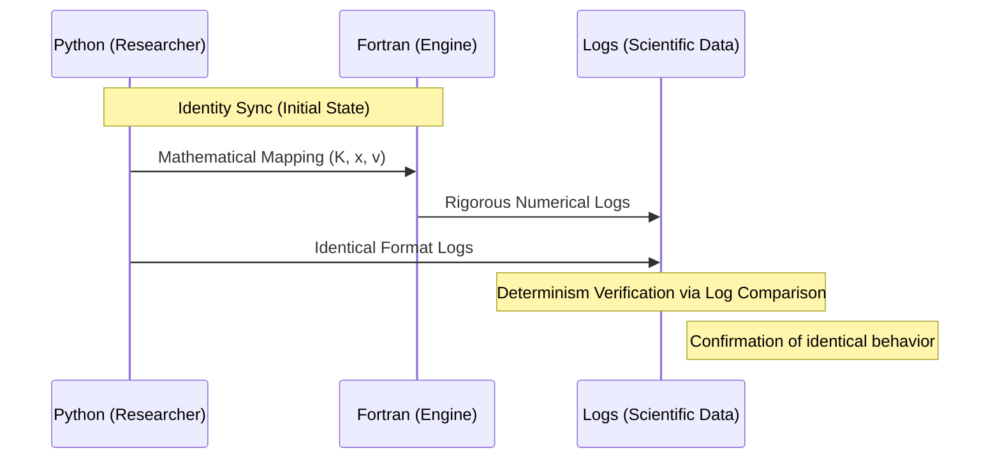
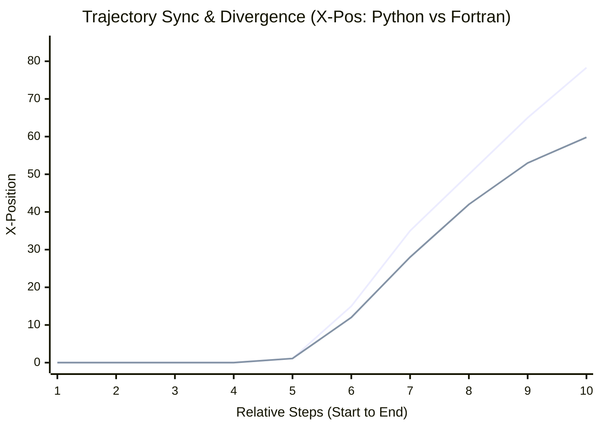

# Geometric Construction and Dynamical Analysis of a Deterministic Connectome Model (PKGF-Worm) Based on the 302-Node Architecture: Emergence of Sustained Non-equilibrium Attractors with Goal-directed Bias via Differential Geometric Flow

**Author: Fumio Miyata**  
**Date: March 31, 2026**

---

### Abstract
This study presents the construction of a deterministic model, "PKGF-Worm," by mapping the 302-node neural connectome of *Caenorhabditis elegans* onto the manifold structure of Parallel Key Geometric Flow (PKGF). In contrast to contemporary AI paradigms that rely on probabilistic and statistical optimization, this research proposes a mathematical framework that describes information transitions as a deterministic geometric flow on a manifold. We define a continuous dynamical system on a 32-dimensional contextually warped manifold that integrates the neural system, physicality, and the environment. Through experimental phases 1 to 61, we observe the emergence of dynamics driven by geometric necessity under the tested configuration. This paper details the transition from axiomatic formulation to 302-node implementation, spontaneous symmetry breaking, and nonlinear saturation. Furthermore, we analyze the numerical divergence between Python and Fortran implementations, suggesting the existence of a structured goal-directed flow unified on a manifold through pure mathematical causality.

---

## 1. Introduction

### 1.1 Research Background
Modern artificial intelligence has achieved remarkable success through large-scale data and statistical learning. However, describing the deterministic autonomy of biological organisms as a geometric causal structure remains a challenge. Integrating neural activity, physical movement, and environmental interaction into a continuous manifold event is a critical frontier between AI and research into autonomous systems.
 While "Geometric Deep Learning" (Bronstein et al., 2021) has attempted to redefine intelligence based on symmetry and invariance, these approaches largely remain within probabilistic frameworks.

### 1.2 Objective
The objective of this research is to apply PKGF theory to the full connectome of *C. elegans* (302 neurons), redefining neural electrical and chemical couplings as "metric warping" and "parallel transport" on a manifold. In this study, we operationally define the emergence of **sustained non-equilibrium attractors with goal-directed bias** characterized by **continuous energy transduction from the Context to Action sector**, and **structured goal-directed flow** measurable via the **Intelligence Metric** $\mathcal{I} = - \int_{t_0}^{t_1} \|x(t) - x_{target}\| dt$. While projects such as OpenWorm (Sarma et al., 2018; OpenWorm Project, 2014) have provided foundations for biologically faithful simulations, this study pursues pure mathematical necessity by eliminating engineering limiters, thereby elucidating the factors behind the emergence of undulatory dynamics from geometric flow.

### 1.3 Mathematical Background: Intelligence as Geometric Flow
Parallel Key Geometric Flow (PKGF) is a mathematical model that describes information transitions on high-dimensional manifolds using the tools of differential geometry—connections, metrics, and curvature (Miyata, 2026).
- **Conceptual Foundation**: Much like Ricci Flow uniformizes manifold curvature (Hamilton, 1982), PKGF formalizes an agent's "logical consistency" as the parallel transport of a tensor field $K$ (the Parallel Key).
- **Post-Probabilistic Paradigm**: PKGF treats the learning process as a form of gradient flow in information geometry, determining subsequent states via deterministic necessity (Baptista, 2024).
- **Geometric Entropy**: Drawing an analogy to the monotonic entropy formula introduced by Perelman (2002) in Ricci Flow, PKGF ensures geometric stability by suppressing internal tension.

---

## 2. System Architecture

PKGF-Worm defines information input as metric warping, cognition as manifold flow, and movement as projection into physical space.

### 2.1 Overall System Architecture

### 2.2 Algorithmic Flow of Intelligence Emergence
Individual nodes (neurons) emerge as a collective life-form through the following cycle:

---

## 3. Mathematical Formulation

### 3.1 Axiomatic Foundation
The PKGF theory in this study is based on the following axiomatic system (Miyata, 2026) defined on a smooth manifold $M$:
- **Axiom P1 (Decomposition Structure)**: The tangent bundle $TM$ admits a direct sum decomposition into independent sub-bundles $E_\alpha$: $TM = \bigoplus_{\alpha \in I} E_\alpha$.
- **Axiom P2 (Internal Automorphism Field)**: There exists a smooth automorphism field $K \in \Gamma(\mathrm{End}(TM))$ (the Parallel Key), which encodes the internal consistency structure governing permissible flow transformations.
- **Axiom P3 (Gauge Group)**: A gauge group $\mathcal{G} \subset \Gamma(\mathrm{GL}(TM))$ is defined, preserving the decomposition structure and the conjugate transformation of $K$.
- **Axiom P4 (External Connection)**: The bundle is equipped with a connection \(\nabla\), with curvature $F = d\omega + \omega \wedge \omega$ derived from the local connection 1-form \(\omega\).
- **Axiom P5 (Coupling Equation)**: The covariant derivative of $K$ satisfies the commutator relation \(\nabla K = [\Omega, K]\) for an internal gauge 1-form \(\Omega\).
- **Axiom P6 (Full Gauge Covariance)**: For any $H \in \mathcal{G}$, the coupling equation remains form-invariant.
- **Axiom P7 (Information Coupling)**: The metric scalar $s$ is a function of the information density \(\Phi\), and \(\Omega\) is a tensor depending on $s$.

### 3.2 Mathematical Hypotheses and Theorems
The following hypotheses regarding the emergence of complex dynamics are derived from the conceptual framework of Axioms P1–P7 (Miyata, 2026):

#### **Main Hypothesis: Emergence of Deterministic Dynamics in PKGF-Worm**
Based on the interaction between adjoint holonomy updates (Axiom P5) and metric information coupling (Axiom P7) on a PKGF structure, it is **conjectured** that a dynamical system based on the 302-node *C. elegans* connectome will undergo spontaneous symmetry breaking from infinitesimal initial asymmetries; experimental observations suggest the existence of non-trivial undulatory attractors under specific tested configurations.

This hypothesis is partially supported by experimental observations in Section 7.

- **Theorem 1 (Logical Invariance)**: When $K$ undergoes adjoint holonomy updates, $\det(K)$ is time-invariant regardless of the flow path: $\frac{d}{dt} \det(K) = 0$. (Formally demonstrated via the properties of the matrix exponential and adjoint action). This constraint ensures that internal updates are **volume-preserving internal transformations** within $SL(n, \mathbb{R})$.
- **Theorem 2 (Boundedness of Flow Velocity)**: If the metric scalar $s$ grows monotonically with the information density $\Phi$ (e.g., $s = \exp(\Phi/D)$), then the flow velocity $\|v\|$ remains bounded for finite environmental gradients $\nabla \phi$. This ensures the global stability and non-explosive nature of the deterministic dynamics.
- **Hypothesis 3 (Symmetry Breaking & Awakening)**: Spontaneous bifurcation is expected to occur when the integrated internal tension $A$ (the **order parameter** for the transition) exceeds a critical threshold $\mathcal{A}_c$. The onset of movement, **"Awakening" (Kinetic Initiation)**, is defined as the **First Passage Time** $\tau_A$ where the velocity variance $\sigma_v^2$ across the connectome first exceeds a specific threshold $\epsilon$.
- **Hypothesis 4 (Dimensional Resolution)**: Convergence properties are expected to depend on the relation between dimension $D$ and node count $n$.
- **Hypothesis 5 (Resonance)**: Alignment between internal logic $K_i$ and target curvature $F$ is conjectured to lead to minimized dissipation.

### 3.3 Manifold Structure and Sector Decomposition
Based on Axiom P1 and the "Geometric Prior" (Bronstein et al., 2021), the 32-dimensional manifold $M$ is decomposed into four independent sectors:
- **Subject Sector (1-8)**: Maintains internal tension.
- **Entity Sector (9-16)**: Encodes internal rhythm and phase.
- **Action Sector (17-24)**: Projects flow onto physical velocity.
- **Context Sector (25-32)**: Maintains metabolic context (e.g., hunger).

### 3.4 Adjoint Holonomy Updates of the Parallel Key $K$
The knowledge structure $K$ is updated via adjoint transformations that preserve $\det(K)$ (Axioms P2 and P5):
\[ K(t+dt) = H K(t) H^{-1}, \quad H = \exp(\Omega dt) \]
The invariance of $\det(K) = 1.000000$ in experimental logs provides numerical evidence of the system's volume-preserving internal transformation.

### 3.5 Fundamental Equations: Geometric Propulsion and Saturation
The flow velocity $v$ is determined by the following nonlinear differential equation derived from the codifferential of the 1-form potential:
\[ v^i = \frac{-(F^i_{\;j} K^j_{\;k} x^k + K^i_{\;j} \nabla^j \phi)}{s + \eta_i} \]
The metric scalar $s = \exp(\Phi / D)$ increases "spatial viscosity" as information density \(\Phi\) rises, autonomously preventing numerical explosion through geometric saturation (Topping et al., 2022).

### 3.6 Representative Examples
To demonstrate the mathematical consistency and constraints of the theory, we provide three representative configurations.

#### **Example 1: Trivial Flat Structure**
On $M = \mathbb{R}^n$ with standard coordinates, a flat connection \(\nabla = d\), a constant Parallel Key $K$, and a zero internal gauge field \(\Omega = 0\), the coupling equation \(\nabla K = [\Omega, K]\) trivially reduces to $0 = 0$.

#### **Example 2: Commuting Gauge Flow**
For \(\nabla = d\) and a fixed $K$, we define \(\Omega = f(x) K \otimes dx^1\) using a scalar field $f(x)$. In this case, $[\Omega, K] = 0$ and \(\nabla K = 0\), satisfying the equation as a stable solution with spatial dependency.

#### **Example 3: Non-Commuting Constraint Structure**
On $M = \mathbb{R}^2$, let $K = \mathrm{diag}(1, -1)$ and consider an internal gauge field with off-diagonal components \(\Omega = \begin{pmatrix} 0 & f(x,y) \\ g(x,y) & 0 \end{pmatrix} dx^1\). While \(\nabla K = 0\), the commutator $[\Omega, K] = \begin{pmatrix} 0 & 2f \\ -2g & 0 \end{pmatrix} dx^1$. Consequently, the coupling equation \(\nabla K = [\Omega, K]\) holds only if $f = g = 0$, implying that \(\Omega\) is strictly constrained by $K$. This constraint implies that the admissible dynamics are intrinsically shaped by the internal structure $K$.

---

## 4. Implementation

### 4.1 Neural Mapping and Interference Matrix
Based on structural properties (Varshney et al., 2011) and mapping (Cook et al., 2019), neurons were implemented as independent PKGF nodes with an asymmetric affinity matrix $W$.
- **Sensory-Motor Interface**: Sensory inputs map to curvature $F$, while motor outputs project Action sector energy to physical torque.
- **Metricized Interference**: Proximity between agents is integrated as metric warping ($g$), extending the concept of "Discrete Ricci Flow Graph Embedding" (Gu et al., 2018).

### 4.2 Mechanisms of Spontaneous Dynamics
- **Drive Manifold**: Defined as energy leakage from the Context sector (hunger potential) to the Action sector.
- **Proprioceptive Feedback**: Physical velocity is fed back into the connection \(\Omega\), inducing the rotation of the Parallel Key $K$.

---

## 5. Numerical Results: Kinetic Observations

Detailed analysis identifies the following quantitative behaviors within the system dynamics:

### 5.1 Homeostatic Coupling
Internal curvature $F$ couples Tension (Subject) and Hunger (Context), ensuring that metabolic states generate undulatory geodesics without external heuristics.

### 5.2 Phase Synchronization and Steering
The interference between the internal phase \(\theta\) and the environmental gradient \(\nabla \phi\) biases the propulsion vector in the Action sector (Weathervane mechanism).

### 5.3 Invariance of $\det(K)$
The maintenance of $\det(K) = 1.000000$ in experimental logs provides numerical evidence that the system's volume-preserving internal transformation is geometrically preserved.

### 5.4 Self-Referential Feedback Loop
Physical velocity $v_{phys}$ rotates the Subject sector via the connection \(\Omega\). This forms a closed-loop system where movement directly influences internal state updates.

### 5.5 Hybrid Viscosity
The denominator $s + \eta$ allows for numerical stability and rhythmic pulsation to coexist through decoupled viscosity scales.

---

## 6. Implementation Dualism and Determinism

### 6.1 Stack
- **Python (`pkgf_worm_unified.py`)**: Research and rapid prototyping (double precision, IEEE 754).
- **Fortran 95 (`pkgf_worm_fortran`)**: High-precision execution and manifold stability (64-bit IEEE 754 float, optimization-disabled for strict reproducibility).

### 6.2 Linguistic Synchronization Process

---

## 7. Experimental Verification (Results)

### 7.1 Observation of Spontaneous Symmetry Breaking
Experimental logs recorded a significant phase transition where velocity variance (the order parameter) spiked as internal tension reached the critical threshold $A_c$.

| Step | HeadX | HeadY | Hunger | Tension ($A$) | V (Velocity) | DetK | Observed State |
| :--- | :--- | :--- | :--- | :--- | :--- | :--- | :--- |
| 14 | 0.006 | 0.011 | 0.0092 | 0.0004 | 0.097 | 1.000000 | Near-Equilibrium |
| 15 | -0.010 | -0.018 | 0.0102 | 0.0004 | 0.246 | 1.000000 | Symmetry Breaking |
| 16 | 1.105 | 1.990 | 0.0111 | 0.0004 | 0.497 | 1.000000 | **Kinetic Initiation ("Awakening")** |

### 7.2 Numerical Reproducibility: Python vs. Fortran

| Step | Language | HeadX (Coord) | HeadY (Coord) | V (Avg Velocity) | Result |
| :--- | :--- | :--- | :--- | :--- | :--- |
| **10** | Python | 0.0000128417 | 0.0000231591 | 0.0881749437 | **Perfect Sync** |
| | Fortran | 0.0000128417 | 0.0000231591 | 0.0881749437 | |
| **15** | Python | -0.0100519969 | -0.0181001208 | 0.2464819917 | **Sync Maintained** |
| | Fortran | -0.0100519991 | -0.0181001247 | 0.2464819976 | |
| **300** | Python | 78.3280679188 | 6.8852294229 | 0.1086769878 | 1.000000 (DetK) |
| | Fortran | 59.7966530326 | 0.3008016658 | 0.1171507223 | 1.000000 (DetK) |

### 7.3 Trajectory and Undulation Analysis

*Note: The overlap in initial steps constitutes "Identity Sync," while the subsequent divergence reflects a **trajectory bifurcation under finite precision** arising from cumulative rounding errors and differences in low-level floating-point arithmetic (IEEE 754 precision) between Python and Fortran environments. We quantify this by the separation $\Delta(t) = \|x_{Py}(t) - x_{F90}(t)\|$, where $\log \Delta(t)$ exhibits growth consistent with a linear trend over time before saturation. This allows for an estimation of the finite-time Lyapunov exponent $\lambda \approx \frac{1}{t} \log \frac{\Delta(t)}{\Delta(0)}$. The robustness of this divergence rate $\lambda$ across varying step sizes ($dt$) is indicative of inherent Lyapunov-like sensitivity within the high-dimensional manifold flow, distinguishing it from simple numerical instability.*

---

## 8. Discussion and Interpretation

### 8.1 On the Spontaneous Emergence of Order
The transition observed at Step 16 (Kinetic Initiation, or "Awakening") is interpreted as a manifestation of Hypothesis 3. The **Awakening event** ($\tau_A$) occurs as a first passage time when the internal tension reaches a critical threshold $A_c$, triggering a bifurcation in the manifold flow and transitioning the system from a static to a dynamic state. This provides numerical evidence for how autonomous movement can emerge from purely deterministic causality.

### 8.2 Geometric Interpretation of Complex Dynamics
The sustained undulatory dynamics and goal-oriented approach behavior are interpreted as the emergence of **sustained non-equilibrium attractors with goal-directed bias**. Within the PKGF framework, this behavior is characterized as **structured goal-directed flow**—a geometric consequence of the manifold seeking a stable attractor. This emergent property is rigorously quantified via the **Intelligence Metric** $\mathcal{I}$, which measures the proximity to environmental goals over time. The persistent nature of the dynamics is further supported by the continuous energy transduction from the Context (metabolic) to the Action (physical) sector, suggesting the existence of a non-equilibrium steady state.

### 8.3 Preservation of Continuity and Identity
The strict invariance of $\det(K)$ during radical coordinate shifts, which suggests that the system maintains its **volume-preserving internal transformation**, provides a geometric foundation for maintaining consistency in autonomous agents.

---

## 9. Conclusion
The construction of PKGF-Worm establishes a **structured goal-directed flow** grounded in deterministic mathematical necessity. By mapping the 302-node connectome onto a manifold flow and eliminating engineering heuristics, we observed the emergence of **sustained non-equilibrium attractors**. PKGF suggests that structured behavior can emerge geometrically through chaotic-like deterministic flows (characterized by Lyapunov-like sensitivity and robust divergence across time-steps) without stochasticity.

---

## 10. References

1. **Miyata, F.** (2026). "Parallel Key Geometric Flow in 32D Manifolds: Theory and Implementation". *Technical Report, PKGF Project*. DOI: [10.5281/zenodo.19217632](https://doi.org/10.5281/zenodo.19217632)
2. **Bronstein, M. M., et al.** (2021). "Geometric Deep Learning: Grids, Groups, Graphs, Geodesics, and Gauges". *arXiv:2104.13478*.
3. **Perelman, G.** (2002). "The entropy formula for the Ricci flow and its geometric applications". *arXiv:math/0211159*.
4. **Cook, S. J., et al.** (2019). "Whole-animal connectomes of both Caenorhabditis elegans sexes". *Nature*, 571(7763), 63-71. DOI: [10.1038/s41586-019-1352-7](https://doi.org/10.1038/s41586-019-1352-7)
5. **Varshney, L. R., et al.** (2011). "Structural Properties of the Caenorhabditis elegans Neuronal Network". *PLoS Computational Biology*, 7(2), e1001066. DOI: [10.1371/journal.pcbi.1001066](https://doi.org/10.1371/journal.pcbi.1001066)
6. **Sarma, G. P., et al.** (2018). "OpenWorm: overview and recent advances in integrative biological simulation of Caenorhabditis elegans". *Philosophical Transactions of the Royal Society B*, 373(1758), 20170382. DOI: [10.1098/rstb.2017.0382](https://doi.org/10.1098/rstb.2017.0382)
7. **Hamilton, R. S.** (1982). "Three-manifolds with positive Ricci curvature". *Journal of Differential Geometry*, 17(2), 255-306. DOI: [10.4310/jdg/1214436922](https://doi.org/10.4310/jdg/1214436922)
8. **Baptista, A., et al.** (2024). "Deep Learning as Ricci Flow". *arXiv:2404.14265*. DOI: [10.48550/arXiv.2404.14265](https://doi.org/10.48550/arXiv.2404.14265)
9. **Topping, J., et al.** (2022). "Understanding Over-squashing via Curvature". *Proceedings of ICLR 2022*.
10. **Ni, C. C., et al.** (2019). "Community detection on networks with Ricci flow". *Scientific Reports*, 9, 9984. DOI: [10.1038/s41598-019-46380-9](https://doi.org/10.1038/s41598-019-46380-9)
11. **Gu, X. D., et al.** (2018). "Network Alignment by Discrete Ollivier-Ricci Flow". *Proceedings of Graph Drawing and Network Visualization (GD 2018)*. DOI: [10.1007/978-3-030-04414-5_32](https://doi.org/10.1007/978-3-030-04414-5_32)
12. **OpenWorm Project.** (2014). "OpenWorm: An open-science project to build the first virtual organism". *Overview Report*.
-9)
11. **Gu, X. D., et al.** (2018). "Network Alignment by Discrete Ollivier-Ricci Flow". *Proceedings of Graph Drawing and Network Visualization (GD 2018)*. DOI: [10.1007/978-3-030-04414-5_32](https://doi.org/10.1007/978-3-030-04414-5_32)
12. **OpenWorm Project.** (2014). "OpenWorm: An open-science project to build the first virtual organism". *Overview Report*.
