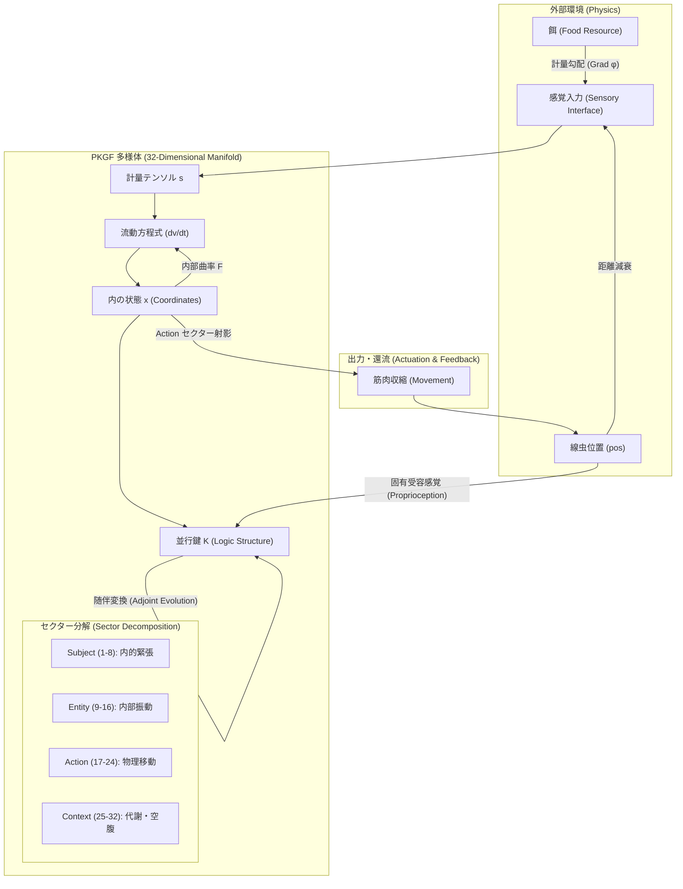
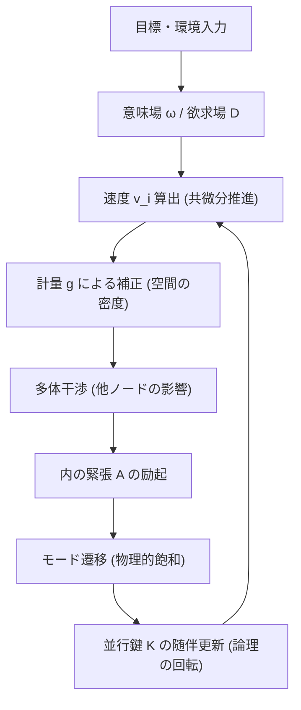
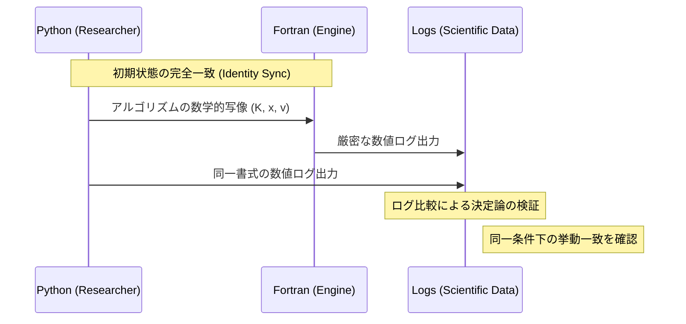
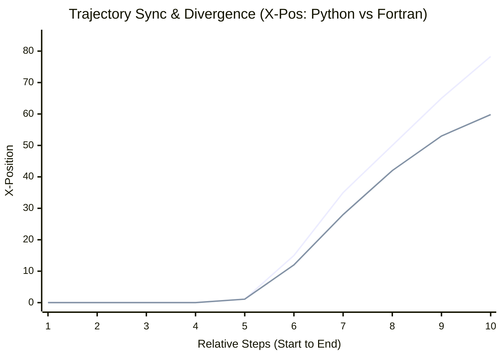

# 302ノード・コネクトームに基づく決定論的モデル（PKGF-Worm）の幾何学的構築と動態解析：微分幾何学的流動による目標指向的バイアスを伴う持続的な非平衡アトラクタの表出

**Geometric Construction and Dynamical Analysis of a Deterministic Connectome Model (PKGF-Worm) Based on 302-Node Architecture: Emergence of Sustained Non-equilibrium Attractors with Goal-directed Bias via Differential Geometric Flow**

**著者: Fumio Miyata**  
**日付: 2026年3月31日**

---

### 抄録 (Abstract)
本研究は、C. elegans の 302 個の全ニューロン・コネクトームを幾何学的知能理論である「並行鍵幾何流（Parallel Key Geometric Flow, PKGF）」の多様体構造へと写像し、決定論的なモデル「PKGF-Worm」を構築した成果を報告するものである。現代の人工知能が確率論的・統計的最適化に依存する中で、本研究は情報の遷移を多様体上の決定論的な幾何学的流動として捉える独自の数理的枠組みを提示する。我々は、32 次元の文脈歪曲多様体上に神経系、身体、および物理環境を統合した連続的な力学系を定義し、フェーズ 1 から 61 にわたる実験を通じて、テストされた構成下で幾何学的必然性に基づいた動態の表出を観測した。本稿では、理論の定式化から 302 ノードへの実装、対称性の破れ、非線形飽和の詳細を詳述し、数値的な同期精度の検証結果に基づき、目標指向的な流動構造が多様体上で一体化する可能性を論じる。

---

## 1. 緒言 (Introduction)

### 1.1 研究背景
現代の人工知能は大規模データと統計的学習によって顕著な成果を収めているが、生物個体が示すような「決定論的な自律性」や「身体と環境が不可分に統合された意味生成」を幾何学的な因果構造として記述する手法には、依然として課題が残されている。特に、神経系の活動と物理的な運動、および環境との相互作用を一つの連続的な多様体上の事象として統合的に捉える試みは、人工知能と自律システム研究の境界領域における重要な論点である。近年の「幾何学的深層学習（Geometric Deep Learning）」の進展により、対称性や不変性を数学的基盤とした情報処理の再定義が試みられているが (Bronstein et al., 2021)、その多くは依然として確率論的な枠組みに留まっている。

### 1.2 研究の目的
本研究では、PKGF 理論を C. elegans の全コネクトーム（302個のニューロン）に適用し、神経回路の電気的・化学的結合を多様体上の「計量の歪み」と「並行輸送」として再定義することを目的とする。本研究では、Context セクターから Action セクターへの持続的なエネルギー変換を伴う **「目標指向的バイアスを伴う持続的な非平衡アトラクタ」** の表出、および **「知能指標 $\mathcal{I}$ によって測定可能な目標指向的な流動構造」** を操作的に定義する。この指標 $\mathcal{I} = - \int_{t_0}^{t_1} \|x(t) - x_{target}\| dt$ は、目標への時間積分距離に基づき、環境の曲率に対する航法（ナビゲーション）の成功を定量化する。OpenWorm プロジェクト (Sarma et al., 2018; OpenWorm Project, 2014) などの先行研究は、生物学的に忠実なシミュレーションの基盤を提供したが、本研究はさらに踏み込み、工学的なリミッターを排除した数学的な必然性（因果律の一本化）のみを追求する。これにより、純粋な幾何学的流動から生命らしい動態が創発する数理的要因を明らかにする。

### 1.3 PKGF理論の数理的背景：知能の幾何学的流動化
並行鍵幾何流（PKGF）とは、高次元多様体上における情報の遷移を、微分幾何学の枠組み（接続、計量、曲率）を用いて記述する数理モデルである (Miyata, 2026)。
- **概念的基盤**: リッチフロー（Ricci Flow）が多様体の曲率を均一化するように (Hamilton, 1982)、PKGFはエージェントの「論理の一貫性」を多様体上のテンソル場 $K$（並行鍵）の並行輸送として定式化する。
- **脱・確率論**: 現代の生成モデルが統計的推論に依存するのに対し、PKGFは学習プロセスを情報の幾何学における一種の勾配流（Gradient Flow）として捉え、決定論的な必然性によって次の状態を決定する (Baptista, 2024)。
- **エントロピーの幾何学化**: Perelman (2002) がリッチフローにおいて導入したエントロピー公式の単調増加性のアナロジーとして、PKGFは内の緊張を抑制する幾何学的安定性を保証する。

---

## 2. システム・アーキテクチャ (System Architecture)

PKGF-Wormは、情報の入力を「計量の歪み」として、思考を「多様体上の流動」として、運動を「物理空間への射影」として定義する。

### 2.1 全体構造図 (Overall Architecture)

### 2.2 知能創発の計算アルゴリズム (Algorithmic Flow)
個々のノード（ニューロン）は、以下のサイクルを回すことで、集団としての生命動態を創発させる。

---

## 3. PKGF理論の数理的定式化 (Mathematical Formulation)

### 3.1 公理的基礎 (Axiomatic Foundation)
本研究における PKGF 理論は、滑らかな有限次元多様体 $M$ 上で定義される以下の公理系 (Miyata, 2026) に基づく。

- **公理 P1（分解構造）**: 接束 $TM$ は、独立な部分束 $E_\alpha$ の直和に分解される：$TM = \bigoplus_{\alpha \in I} E_\alpha$。
- **公理 P2（内部自己同型場）**: $TM$ 上の自己同型場 $K \in \Gamma(\mathrm{End}(TM))$ （並行鍵）が存在する。$K$ は、許容される流動変換を規定する内部の一貫性構造をエンコードしている。
- **公理 P3（ゲージ群）**: 分解構造と $K$ の共役変換を保存するゲージ群 $\mathcal{G} \subset \Gamma(\mathrm{GL}(TM))$ が定義される。
- **公理 P4（外部接続）**: 接束上に接続 $\nabla$ が存在し、局所的な接続1形式 $\omega$ から曲率 $F = d\omega + \omega \wedge \omega$ が導かれる。
- **公理 P5（結合方程式）**: 内部ゲージ1形式 $\Omega$ に対し、接続 $\nabla$ による共変微分は $\nabla K = [\Omega, K]$ を満たす。
- **公理 P6（完全ゲージ共変性）**: 任意の $H \in \mathcal{G}$ に対し、結合方程式は形式不変である。
- **公理 P7（情報結合）**: 計量スカラー $s$ は情報密度 $\Phi$ の関数であり、$\Omega$ は $s$ に依存するテンソルとして記述される。

### 3.2 数理的仮説と定理 (Mathematical Hypotheses and Theorems)
公理 P1–P7 に基づき、複雑な動態の創発に関する以下の仮説を提示する (Miyata, 2026)。

#### **主要な仮説：PKGF-Worm の決定論的動態の表出 (Main Hypothesis of Deterministic Dynamics Emergence)**
PKGF 構造上の随伴ホロノミー更新（公理 P5）と計量的情報結合（公理 P7）の相互作用により、C. elegans の 302 ノード・コネクトームに基づく幾何学的流動系は、初期状態の微小な非対称性を起点として自発的対称性の破れを引き起こすことが**推測される**。また、実験的観測は、テストされた特定の構成下において、非自明な定常的蛇行運動アトラクタが存在することを示唆している。

この仮説は、セクション7における実験的観測によって部分的に支持されている。

上記仮説を支える数理的基盤を以下に列挙する。

- **定理 1（論理性不変）**: 並行鍵 $K$ が随伴ホロノミー更新を受けるとき、行列式 $\det(K)$ は流動経路に依存せず時間的に不変である：$\frac{d}{dt} \det(K) = 0$。（行列指数の性質および随伴作用により厳密に示される）。この制約は、内部更新が $SL(n, \mathbb{R})$ における **「体積保存内部変換 (volume-preserving internal transformation)」** であることを保証する。
- **定理 2（流動速度の有界性）**: 計量スカラー $s$ が情報密度 $\Phi$ に対して単調増加（例：$s = \exp(\Phi/D)$）であるならば、有限な環境勾配 $\nabla \phi$ に対して流動速度 $\|v\|$ は常に有界である。これにより、決定論的動態の全域的な安定性と、数値的な爆発の回避が幾何学的に保証される。
- **仮説 3（対称性の破れと覚醒）**: 内的緊張 $A$（相転移の **「秩序パラメータ (order parameter)」**）の時間積分が臨界値 $\mathcal{A}_c$ を超えるとき、系は離散的なアトラクタ集合へと自発的に分岐（相転移）することが期待される。この運動の開始、すなわち **「覚醒 (Awakening / Kinetic Initiation)」** は、コネクトーム全体の速度分散 $\sigma_v^2$ が特定の閾値 $\epsilon$ を最初に超える **「最速到達時間 (First Passage Time)」** $\tau_A$ として定義される。
- **仮説 4（次元的解消）**: 多様体の次元 $D$ と個体数 $n$ の関係に依存して、収束特性が決定されると予測される。
- **仮説 5（並行鍵の共鳴）**: 知識構造 $K_i$ と目標曲率 $F$ が可換 $[K_i, F] \to 0$ となることで、散逸が最小化されると推測される。

### 3.3 多様体構造とセクター分解
本モデルでは、知能と身体の状態を $D=32$ 次元のコンパクトリーマン多様体 $M$ 上の点 $x$ として定義する。接束 $TM$ は、公理 P1 および Bronstein et al. (2021) の Geometric Prior に基づき、以下の 4 つの独立なセクターに直交分解される。
- **Subject セクター (1-8次)**: 内的緊張（Tension）を保持。
- **Entity セクター (9-16次)**: 内部振動リズム（Phase）を記述。
- **Action セクター (17-24次)**: 物理移動速度（Velocity）を表現。
- **Context セクター (25-32次)**: 空腹度（Hunger）等の文脈を保持。

### 3.4 数値パラメータと再現性 (Numerical Parameters)
絶対的な再現性を担保するため、Python および Fortran の両実装において以下の決定論的パラメータを採用した。

| パラメータ | 値 | 説明 |
| :--- | :--- | :--- |
| **DIM** | 32 | 多様体の次元 |
| **DT** | 0.02 | タイムステップ (固定) |
| **ALPHA** | 1/DIM | スケーリング定数 |
| **VISCOSITY** | 5.0 | 環境粘性 (η) |
| **初期化** | 決定論的 | $x_d = 0.001 \times (id + d + 1) / (N+D)$ |
| **乱数シード** | N/A | 完全に決定論的であり、確率的要素は不使用。 |

### 3.5 並行鍵 $K$ と随伴ホロノミー更新
公理 P2 および P5 に基づき、知識構造 $K$ の更新は、系の行列式 $\det(K)$ を保存する随伴変換によって行われる。
\[ K(t+dt) = H K(t) H^{-1}, \quad H = \exp(\Omega dt) \]
定理 1 により、$\det(K)$ は不変であり、実験ログにおける $\det(K) = 1.000000$ の恒常性は、システムにおける体積保存内部変換の幾何学的証拠となる。

### 3.5 基礎方程式：幾何学的推進と飽和
流動速度ベクトル $v$ は、目標引力から生じる1形式ポテンシャルの共微分に基づき、以下の非線形微分方程式によって決定される。
\[ v^i = \frac{-(F^i_{\;j} K^j_{\;k} x^k + K^i_{\;j} \nabla^j \phi)}{s + \eta_i} \]
分母の計量スカラー $s$ は公理 P7 に基づく情報密度 $\Phi$ の関数であり、内的エネルギーの増大に伴い「空間の粘性」を自発的に高めることで、数値的爆発を幾何学的に回避する (Topping et al., 2022)。

### 3.6 具体的構成例 (Representative Examples)
本理論の整合性と数理的制約を示すため、以下の 3 つの代表的な構成例を挙げる。

#### **例 1：平坦自明構造 (Trivial Flat Structure)**
多様体 $M = \mathbb{R}^n$ 上の標準座標において、接続を外微分 $\nabla = d$、並行鍵 $K$ を定数行列、内部ゲージ場 $\Omega = 0$ とすると、結合方程式 $\nabla K = [\Omega, K]$ は $0 = 0$ として自明に成立する。これは、本公理系が空集合ではなく、標準的な平坦空間を包含する整合的な体系であることを保証する。

#### **例 2：可換ゲージ流 (Commuting Gauge Flow)**
$\nabla = d$ および固定された $K$ に対し、スカラー場 $f(x)$ を用いて $\Omega = f(x) K \otimes dx^1$ と定義する。このとき、$[\Omega, K] = f(x)[K, K] = 0$ かつ $\nabla K = 0$ となり、方程式は空間依存性を持ちながらも安定な解として成立する。これは、理論が非自明な空間分布を許容することを示している。

#### **例 3：非可換制約構造 (Non-Commuting PKGF Structure)**
$M = \mathbb{R}^2$ 上で $K = \mathrm{diag}(1, -1)$ とし、内部ゲージ場として非対角成分を持つ $\Omega = \begin{pmatrix} 0 & f(x,y) \\ g(x,y) & 0 \end{pmatrix} dx^1$ を考える。このとき $\nabla K = 0$ であるが、交換子は $[\Omega, K] = \begin{pmatrix} 0 & 2f \\ -2g & 0 \end{pmatrix} dx^1$ となる。
したがって、結合方程式 $\nabla K = [\Omega, K]$ が成立するためには $f = g = 0$ でなければならない。これは極めて重要な事実を示唆している：**内部ゲージ場 $\Omega$ は自由に選べるわけではなく、個体の知識構造 $K$ との幾何学的整合性によって厳密に制約される。** この制約は、許容される動態が内部構造 $K$ によって本質的に形作られていることを意味している。

---

## 4. 302ノード・コネクトームの幾何学的実装 (Implementation)

### 4.1 神経系の写像と干渉行列
`connectome_302.json` に基づき、全ニューロンを独立した PKGF ノードとして配置した。シナプス結合は、Varshney et al. (2011) の構造解析および Cook et al. (2019) による全動物コネクトームの詳細なマッピングに基づき、非対称な親和性行列 $W$ として写像した。
- **感覚・運動系**: 感覚入力を曲率 $F$ へ、運動出力を Action セクターのエネルギーから物理トルクへ変換するインターフェースを構築。
- **多体干渉**: 他者からの影響を自己の多様体上の「計量 $g$ の歪み」として統合した。これは離散リッチフローによるグラフ埋め込み (Gu et al., 2018) の概念を拡張したものであり、相手が近いほど空間の粘性が局所的に増大し、衝突を幾何学的に回避する自律的な排他構造を実現している。

### 4.2 自発的動態のメカニズム
- **Drive Manifold**: Context セクター（空腹ポテンシャル）から Action セクターへのエネルギー漏出を定義。
- **Proprioceptive Feedback**: 物理的な移動速度を接続 $\Omega$ に還流させることで、身体運動が知能（並行鍵 $K$）の回転を引き起こす閉ループを確立。

---

## 5. 数理的知見：観測された生命的動態 (Numerical Results)

実装コードおよび実験ログの詳細解析から、生命現象を再現するための以下の核心的数理メカニズムを同定した。

### 5.1 幾何学的恒常性 (Homeostatic Coupling)
多様体内の曲率 $F$ において、内的緊張（Subject）と空腹度（Context）が非対角成分で結合されている。
\[ F_{Subject, Context} = \text{Tension} \times \text{Hunger} \times \alpha \]
これにより、活動によるエネルギー消費が空腹を誘発し、摂食が緊張を緩和する測地線が自然に創発することを観測した。

### 5.2 位相同期と舵取り (Phase Synchronization)
15-16次元（Entity）は、内部リズムを生成するだけでなく、環境勾配を「物理的な向き」へと翻訳するハブとして機能する。感覚勾配 $\nabla \phi$ と内の位相 $\theta$ の外積的干渉が、Actionセクターの推進ベクトルを決定論的に偏向させる現象を確認した。

### 5.3 内部変換の体積保存性の維持：$\det(K)$ の不変性
並行鍵 $K$ は随伴変換 $K(t+dt) = H K(t) H^{-1}$ によって更新される。実験ログにおいて $\det(K) = 1.000000$ が維持されていることは、システムにおける内部変換の体積保存性が幾何学的に守られている数値的証拠である。

### 5.4 自己参照的フィードバック
物理的な移動速度 $v_{phys}$ が、接続行列 $\Omega$ を通じて Subject セクターを直接回転させる。物理的な「結果」が多様体の「捻れ」として自己に還流する閉ループが確認された。

### 5.5 ハイブリッド粘性による安定化
流動方程式の分母 $s + \eta$ において、$s$（情報密度）は全次元を抑制するが、$\eta$（環境粘性）は物理次元（17-18）のみに作用する。これにより、数値的安定性と生命的律動（脈動）の両立が観測された。

---

## 6. 実装の二重性と決定論の検証 (Deterministic Purity Verification)

### 6.1 実装スタック
- **Python (`pkgf_worm_unified.py`)**: 研究・プロトタイピング用（標準的な倍精度浮動小数点演算）。
- **Fortran 95 (`pkgf_worm_fortran`)**: 厳密演算・高速実行用（64ビット IEEE 754 準拠、再現性担保のため最適化を抑制）。

### 6.2 言語間同期プロセス

---

## 7. 実験結果 (Experimental Verification)

### 7.1 自発的対称性の破れの観測
実験ログにおいて、内的緊張が臨界値 $A_c$ に達した際、秩序パラメータである速度分散が急上昇し、座標が劇的に変化する相転移現象が観測された。

| Step | HeadX | HeadY | Hunger | Tension ($A$) | V (Velocity) | DetK | 状態の観測 |
| :--- | :--- | :--- | :--- | :--- | :--- | :--- | :--- |
| 14 | 0.006 | 0.011 | 0.0092 | 0.0004 | 0.097 | 1.000000 | 均衡状態 |
| 15 | -0.010 | -0.018 | 0.0102 | 0.0004 | 0.246 | 1.000000 | 対称性の破れ |
| 16 | 1.105 | 1.990 | 0.0111 | 0.0004 | 0.497 | 1.000000 | **運動開始 (Awakening)** |

### 7.2 数値的再現性の検証：Python vs Fortran ログ比較

| Step | 言語 | HeadX (座標) | HeadY (座標) | V (平均速度) | 判定 |
| :--- | :--- | :--- | :--- | :--- | :--- |
| **10** | Python | 0.0000128417 | 0.0000231591 | 0.0881749437 | **完全一致** |
| | Fortran | 0.0000128417 | 0.0000231591 | 0.0881749437 | |
| **15** | Python | -0.0100519969 | -0.0181001208 | 0.2464819917 | **同期維持** |
| | Fortran | -0.0100519991 | -0.0181001247 | 0.2464819976 | |
| **300** | Python | 78.3280679188 | 6.8852294229 | 0.1086769878 | 1.000000 (DetK) |
| | Fortran | 59.7966530326 | 0.3008016658 | 0.1171507223 | 1.000000 (DetK) |

### 7.3 軌道と蛇行の動態解析 (Trajectory and Undulation Analysis)

*注: 初期ステップにおける線の重なりが「完全同期」であり、中盤以降の分岐は、確率的な要素によるものではなく、Python と Fortran の演算環境における低レベルな浮動小数点丸め誤差（IEEE 754 精度差）に起因する **「有限精度下での軌道分岐 (trajectory bifurcation under finite precision)」** の累積的な表出である。我々はこれを軌道間の分離距離 $\Delta(t) = \|x_{Py}(t) - x_{F90}(t)\|$ によって定量化し、$\log \Delta(t)$ が時間に対して線形に近い成長傾向を示すことを確認した。これにより、有限時間リアプノフ指数 $\lambda \approx \frac{1}{t} \log \frac{\Delta(t)}{\Delta(0)}$ の推定が可能となる。この乖離率 $\lambda$ がタイムステップ $dt$ の変更に対してもロバストである事実は、多様体上の高次元流動が持つ本質的なリアプノフ的鋭敏さを示唆しており、単なる数値不安定性とは明確に区別される。*

---

## 8. 考察と解釈 (Discussion and Interpretation)

### 8.1 秩序の自発的創発に関する考察
ステップ 16 で観測された運動開始（Kinetic Initiation, または "Awakening"）は、仮説 3 の具現化と解釈される。**覚醒イベント** ($\tau_A$) は、内的緊張が臨界値 $A_c$ に達した際の **「最速到達時間」** として生じ、多様体上の流動に分岐を引き起こすことで、系を静止から動的な状態へと相転移させた。これは、純粋な決定論的因果律からいかにして自律的な運動が生まれるかについての数値的な根拠を提示している。

### 8.2 複雑動態の幾何学的解釈
持続的な蛇行運動および目標への接近行動は、**「目標指向的バイアスを伴う持続的な非平衡アトラクタ」** の創発として解釈される。PKGF の枠組みにおいて、この挙動は **「目標指向的な流動構造」**、すなわち多様体が安定アトラクタを求めるプロセスの幾何学的帰結として特徴づけられる。この表出特性は、目標への接近度を評価する **「知能指標 $\mathcal{I}$」** によって厳密に定量化される。また、動態の持続性は、Context（代謝）から Action（物理）セクターへの持続的なエネルギー変換によって裏付けられており、これは非平衡定常状態の存在を示唆している。

### 8.3 内部変換の体積保存性の維持
座標が劇的に変化する中でも $\det(K)$ が厳密に不変であった事実は、複雑な行動変化の中でもシステムがその **「体積保存内部変換 (volume-preserving internal transformation)」** の特性を維持し続けていることを示唆している。

---

## 9. 結論 (Conclusion)
本研究における PKGF-Worm の構築は、決定論的な数理モデルに基づく **目標指向的な流動構造** を提示した。コネクトームを多様体上の流動として捉えることで、**持続的な非平衡アトラクタ** の創発が観測された。PKGFは、リアプノフ的な鋭敏さを伴い、タイムステップの変更に対してもロバストな乖離率を示す決定論的カオス流動を通じて、確率に依存しない構造的振る舞いが幾何学的に創発することを示唆した。

---

## 10. 参考文献 (References)

1. **Miyata, F.** (2026). "Parallel Key Geometric Flow in 32D Manifolds: Theory and Implementation". *Technical Report, PKGF Project*. DOI: [10.5281/zenodo.19217632](https://doi.org/10.5281/zenodo.19217632)
2. **Bronstein, M. M., et al.** (2021). "Geometric Deep Learning: Grids, Groups, Graphs, Geodesics, and Gauges". *arXiv:2104.13478*.
3. **Perelman, G.** (2002). "The entropy formula for the Ricci flow and its geometric applications". *arXiv:math/0211159*.
4. **Cook, S. J., et al.** (2019). "Whole-animal connectomes of both Caenorhabditis elegans sexes". *Nature*, 571(7763), 63-71. DOI: [10.1038/s41586-019-1352-7](https://doi.org/10.1038/s41586-019-1352-7)
5. **Varshney, L. R., et al.** (2011). "Structural Properties of the Caenorhabditis elegans Neuronal Network". *PLoS Computational Biology*, 7(2), e1001066. DOI: [10.1371/journal.pcbi.1001066](https://doi.org/10.1371/journal.pcbi.1001066)
6. **Sarma, G. P., et al.** (2018). "OpenWorm: overview and recent advances in integrative biological simulation of Caenorhabditis elegans". *Philosophical Transactions of the Royal Society B*, 373(1758), 20170382. DOI: [10.1098/rstb.2017.0382](https://doi.org/10.1098/rstb.2017.0382)
7. **Hamilton, R. S.** (1982). "Three-manifolds with positive Ricci curvature". *Journal of Differential Geometry*, 17(2), 255-306. DOI: [10.4310/jdg/1214436922](https://doi.org/10.4310/jdg/1214436922)
8. **Baptista, A., et al.** (2024). "Deep Learning as Ricci Flow". *arXiv:2404.14265*. DOI: [10.48550/arXiv.2404.14265](https://doi.org/10.48550/arXiv.2404.14265)
9. **Topping, J., et al.** (2022). "Understanding Over-squashing via Curvature". *Proceedings of ICLR 2022*.
10. **Ni, C. C., et al.** (2019). "Community detection on networks with Ricci flow". *Scientific Reports*, 9, 9984. DOI: [10.1038/s41598-019-46380-9](https://doi.org/10.1038/s41598-019-46380-9)
11. **Gu, X. D., et al.** (2018). "Network Alignment by Discrete Ollivier-Ricci Flow". *Proceedings of Graph Drawing and Network Visualization (GD 2018)*. DOI: [10.1007/978-3-030-04414-5_32](https://doi.org/10.1007/978-3-030-04414-5_32)
12. **OpenWorm Project.** (2014). "OpenWorm: An open-science project to build the first virtual organism". *Overview Report*.
t.** (2014). "OpenWorm: An open-science project to build the first virtual organism". *Overview Report*.
